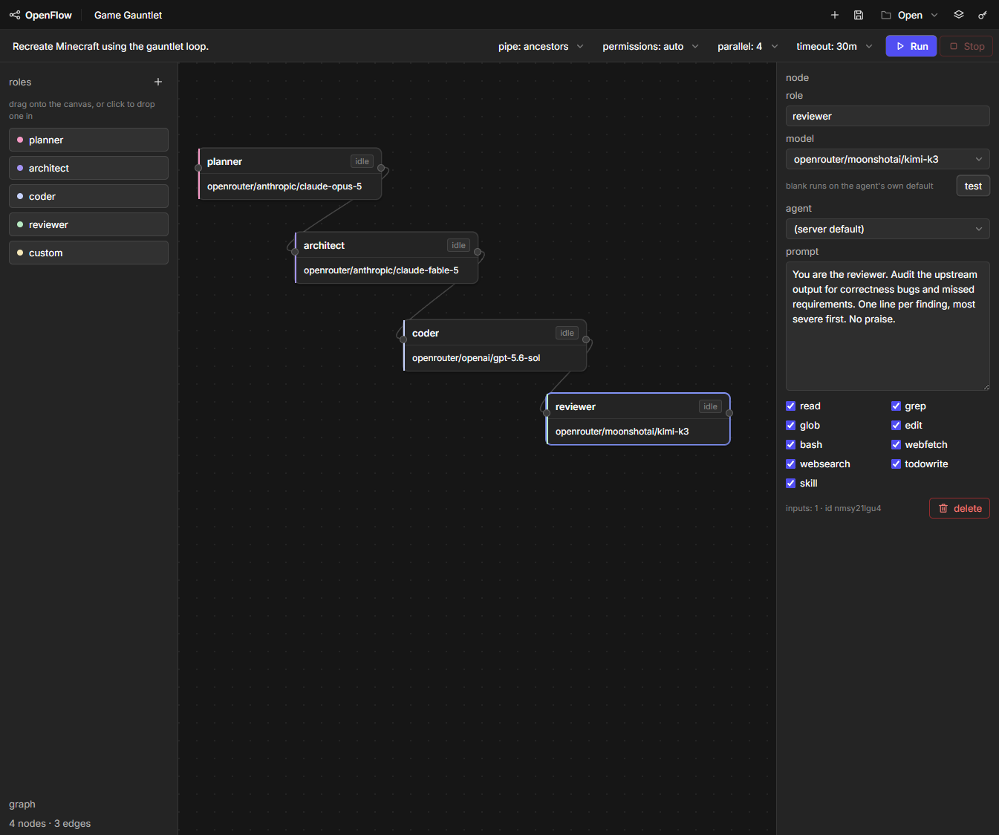

# OpenFlow

**OpenFlow is a visual builder for multi-agent AI workflows.** Drag role cards
onto a canvas, wire a pipeline (planner → architect → coder), save it, and run it
with real parallel agents.



OpenFlow is its own project. It is built on — and ships as a fork of —
[opencode](https://github.com/anomalyco/opencode), whose headless engine
(`opencode serve`) drives the agents underneath. All of OpenFlow's own code lives
in [`packages/flow`](packages/flow); no upstream package is modified, so the
OpenCode engine stays current and upstream merges stay clean. The original
OpenCode README follows below.

### Install

**Prerequisites**

- [Bun](https://bun.sh) 1.3 or newer — the only runtime OpenFlow needs (it runs
  the engine, the build, and the canvas). `bun --version` to check.
- [Git](https://git-scm.com).

**Get the code**

```bash
git clone https://github.com/SeeRay11/OpenFlow.git
cd OpenFlow
bun install
```

`bun install` pulls the whole workspace — the OpenCode engine plus OpenFlow's own
code in [`packages/flow`](packages/flow). First install is large; it downloads the
engine's native deps and runs a `postinstall` that builds `node-pty`.

### Run it

**Quick start — one command starts both processes:**

```bash
./openflow.ps1   # Windows (PowerShell)
./openflow.sh    # macOS / Linux
```

The launcher starts the engine, waits until it is listening, then opens the
canvas on http://localhost:5174; Ctrl+C stops both. Point the agents at another
repo with `-Project <dir>` (PowerShell) or `-p <dir>` (shell); pass `-Built` /
`-b` to serve the built bundle. Still log a provider in first (see below).

Or start the two processes by hand. The server first:

```bash
bun run --cwd packages/opencode --conditions=browser src/index.ts serve --port 4096
```

Then the canvas, on http://localhost:5174:

```bash
bun run --cwd packages/flow dev
```

Or run it built, which serves the same app without vite:

```bash
bun run --cwd packages/flow build && bun run --cwd packages/flow start
```

### Before the first run

- **Log a provider in first.** The server owns the credentials and Flow inherits
  them; there is no key-entry UI. Use opencode's own `providers login`, provider
  env vars, or `OPENCODE_AUTH_CONTENT`. The model dropdown filling up is the
  signal that auth worked.
- **Set `OPENFLOW_PROJECT`** to the repo the agents should work in. It defaults
  to this one, and these agents write real files.
- **Restart `opencode serve` after "merge agents".** The server reads a project's
  `opencode.json` once and caches it, so freshly merged agents stay invisible
  until it restarts. Flow's pre-flight check refuses the run rather than letting
  a node execute as an agent that does not exist.
- **Permissions default to `auto`,** which approves each request for that one
  call. Switch the toolbar to `ask me` if you want to see them. Every decision is
  written to the run log either way.

Details — endpoints, engine, data model, generated agent config — are in
[`packages/flow/README.md`](packages/flow/README.md).

---

<p align="center">
  <a href="https://opencode.ai">
    <picture>
      <source srcset="packages/console/app/src/asset/logo-ornate-dark.svg" media="(prefers-color-scheme: dark)">
      <source srcset="packages/console/app/src/asset/logo-ornate-light.svg" media="(prefers-color-scheme: light)">
      
    </picture>
  </a>
</p>
<p align="center">The open source AI coding agent.</p>

<p align="center"><sub><b>OpenFlow</b> is an independent fork. It is not affiliated with, sponsored by, or endorsed by the OpenCode team.</sub></p>
<p align="center">
  <a href="https://opencode.ai/discord"></a>
  <a href="https://www.npmjs.com/package/opencode-ai"></a>
  <a href="https://github.com/anomalyco/opencode/actions/workflows/publish.yml"></a>
</p>

<p align="center">
  <a href="README.md">English</a> |
  <a href="README.zh.md">简体中文</a> |
  <a href="README.zht.md">繁體中文</a> |
  <a href="README.ko.md">한국어</a> |
  <a href="README.de.md">Deutsch</a> |
  <a href="README.es.md">Español</a> |
  <a href="README.fr.md">Français</a> |
  <a href="README.it.md">Italiano</a> |
  <a href="README.da.md">Dansk</a> |
  <a href="README.ja.md">日本語</a> |
  <a href="README.pl.md">Polski</a> |
  <a href="README.ru.md">Русский</a> |
  <a href="README.bs.md">Bosanski</a> |
  <a href="README.ar.md">العربية</a> |
  <a href="README.no.md">Norsk</a> |
  <a href="README.br.md">Português (Brasil)</a> |
  <a href="README.th.md">ไทย</a> |
  <a href="README.tr.md">Türkçe</a> |
  <a href="README.uk.md">Українська</a> |
  <a href="README.bn.md">বাংলা</a> |
  <a href="README.gr.md">Ελληνικά</a> |
  <a href="README.vi.md">Tiếng Việt</a>
</p>

[](https://opencode.ai)

---

### Installation

```bash
# YOLO
curl -fsSL https://opencode.ai/install | bash

# Package managers
npm i -g opencode-ai@latest        # or bun/pnpm/yarn
scoop install opencode             # Windows
choco install opencode             # Windows
brew install anomalyco/tap/opencode # macOS and Linux (recommended, always up to date)
brew install opencode              # macOS and Linux (official brew formula, updated less)
sudo pacman -S opencode            # Arch Linux (Stable)
paru -S opencode-bin               # Arch Linux (Latest from AUR)
mise use -g opencode               # Any OS
nix run nixpkgs#opencode           # or github:anomalyco/opencode for latest dev branch
```

> [!TIP]
> Remove versions older than 0.1.x before installing.

### Desktop App (BETA)

OpenCode is also available as a desktop application. Download directly from the [releases page](https://github.com/anomalyco/opencode/releases) or [opencode.ai/download](https://opencode.ai/download).

| Platform              | Download                           |
| --------------------- | ---------------------------------- |
| macOS (Apple Silicon) | `opencode-desktop-mac-arm64.dmg`   |
| macOS (Intel)         | `opencode-desktop-mac-x64.dmg`     |
| Windows               | `opencode-desktop-windows-x64.exe` |
| Linux                 | `.deb`, `.rpm`, or `.AppImage`     |

```bash
# macOS (Homebrew)
brew install --cask opencode-desktop
# Windows (Scoop)
scoop bucket add extras; scoop install extras/opencode-desktop
```

#### Installation Directory

The install script respects the following priority order for the installation path:

1. `$OPENCODE_INSTALL_DIR` - Custom installation directory
2. `$XDG_BIN_DIR` - XDG Base Directory Specification compliant path
3. `$HOME/bin` - Standard user binary directory (if it exists or can be created)
4. `$HOME/.opencode/bin` - Default fallback

```bash
# Examples
OPENCODE_INSTALL_DIR=/usr/local/bin curl -fsSL https://opencode.ai/install | bash
XDG_BIN_DIR=$HOME/.local/bin curl -fsSL https://opencode.ai/install | bash
```

### Agents

OpenCode includes two built-in agents you can switch between with the `Tab` key.

- **build** - Default, full-access agent for development work
- **plan** - Read-only agent for analysis and code exploration
  - Denies file edits by default
  - Asks permission before running bash commands
  - Ideal for exploring unfamiliar codebases or planning changes

Also included is a **general** subagent for complex searches and multistep tasks.
This is used internally and can be invoked using `@general` in messages.

Learn more about [agents](https://opencode.ai/docs/agents).

### Documentation

For more info on how to configure OpenCode, [**head over to our docs**](https://opencode.ai/docs).

### Contributing

If you're interested in contributing to OpenCode, please read our [contributing docs](./CONTRIBUTING.md) before submitting a pull request.

### Building on OpenCode

If you are working on a project that's related to OpenCode and is using "opencode" as part of its name, for example "opencode-dashboard" or "opencode-mobile", please add a note to your README to clarify that it is not built by the OpenCode team and is not affiliated with us in any way.

---

**Join our community** [Discord](https://discord.gg/opencode) | [X.com](https://x.com/opencode)
